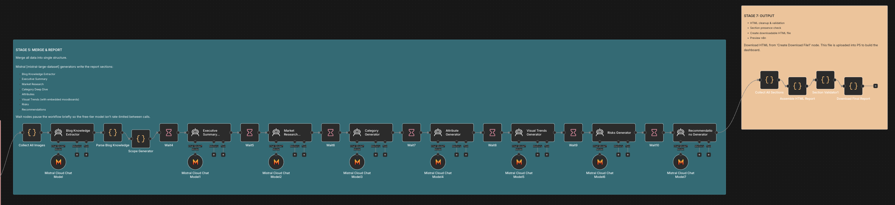
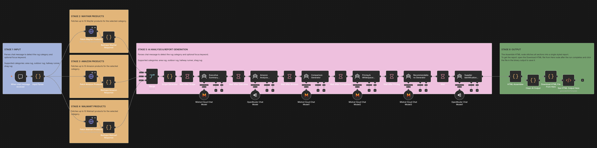
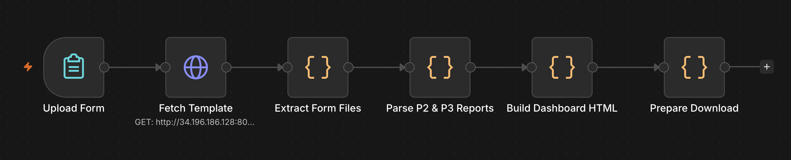
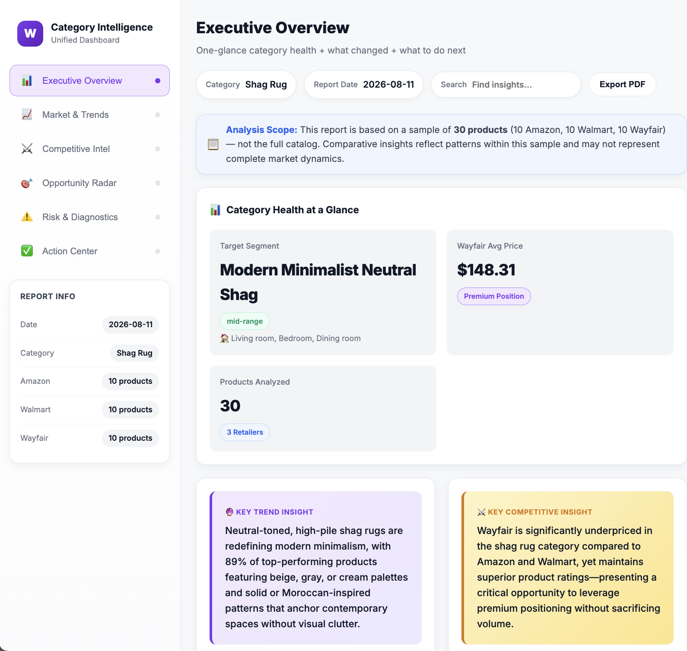

# Wayfair AI Agent Engineering for Business Intelligence

**Program:** Extern — Wayfair AI Agent Engineering for Business Intelligence Externship
**Duration:** June 29 – August 24, 2026
**Category analyzed:** Shag Rugs
**Status:** Complete. All 5 projects delivered. Recognized as a **Top Performer** (top 10% of participants).

---

## Overview

An eight-week externship building AI agents for Wayfair's Rugs category. The brief was to build agents that track design trends, monitor competitors, and generate marketing content, then combine them into one dashboard a category manager can use.

Each project feeds the next:

| Project | Agent | Business question it answers |
|---|---|---|
| 1 | Moodboard Generator | What could this trend look like? |
| 2 | Market Trend Discovery | What's happening in the category right now? |
| 3 | Competitor Monitoring | What are Amazon and Walmart doing? |
| 4 | AI Insights & Content | What should we say about it? |
| 5 | Dashboard Builder | What do I look at to decide? |

---

## Stack

| Layer | Tool |
|---|---|
| Orchestration | n8n |
| Prompt engineering / chat model | Google Gemini |
| Image analysis | Gemini Vision (colors, patterns, textures from social imagery) |
| Classification & attribute extraction | OpenRouter |
| Report generation | Mistral (`mistral-large-latest`) |
| Image generation | Hugging Face (FLUX.1-schnell) |
| Product & social data | Extern API (Apify-backed), Architectural Digest & Dezeen RSS |
| Output | Self-contained HTML reports and dashboard |

---

## Project 1 — Moodboard Generator

Turns a style phrase like "bohemian rugs, neutral tones" into a finished moodboard image.

**Flow:** Chat trigger → AI Agent (Gemini) → Clean Prompt (Code) → Hugging Face image API (HTTP) → Rename Output File (Code)

Two nodes do the work that makes this run reliably. The Clean Prompt node strips line breaks and Markdown and converts double quotes to single quotes, so the string doesn't break the HTTP node downstream. The Rename Output File node rebuilds the returned binary with the correct filename, extension, and MIME type using `getBinaryDataBuffer()` and `prepareBinaryData()`. Without it, Hugging Face returns an image that won't open.

The system message defines the agent as a prompt engineer rather than an image generator. It takes a vague idea and returns one polished image prompt.

---

## Project 2 — Market Trend Discovery Agent

A seven-stage pipeline that turns a rug category into an HTML trend report.

| Stage | What it does |
|---|---|
| 1 | Input validation and routing. Detects category, captures optional focus keyword, exits early on invalid input |
| 2A | Fetches Amazon product data (names, prices, ratings, images) via the Extern API |
| 2B | Fetches Instagram, Pinterest, blog, and market-forecast signals in parallel. Gemini Vision analyzes the imagery |
| 3 | Classifies products, extracts attributes, identifies micro-segments |
| 4 | Generates moodboard visuals per segment |
| 5–6 | Writes each report section under separate analyst personas |
| 7 | Assembles and validates the final HTML |

### Stages 1–2: input routing and data collection


### Stages 3–4: AI processing and image generation


### Stages 5–7: section generation and output validation



### Engineering decisions

**RSS source quality.** The default feeds were personal lifestyle blogs producing household-hack content rather than design intelligence. I replaced them with Architectural Digest and Dezeen so the signal reaching the LLM was actually about design.

**Two-tier relevance filter.** Exact string matching failed on sub-categories, because searching "shag rug" missed articles about "rugs." I added root-word extraction in the merge node, so "shag rug" reduces to "rug," then required a second condition: the item also has to contain a design-context word (`decor`, `interior`, `style`, `living room`, `trend`). An item is kept only if it satisfies both. This cut irrelevant articles without losing coverage.

**Token budget.** I expanded RSS excerpt truncation from 400 to 600 characters. That gives the downstream LLM enough depth on materials, colors, and patterns while keeping token cost reasonable.

**Cost architecture.** Stages 1 and 2 are plain JavaScript and HTTP calls with no LLM tokens spent. AI only enters at Stage 3. This kept cost and latency down, and it made failures easier to locate, since a broken fetch and a broken prompt fail differently.

**Mock routes for blocked sources.** Instagram and Pinterest block scraping and their terms prohibit it. I kept mock routes for both so the workflow executes reliably every run, and used live RSS as the real source of current signal.

### Selected findings, Shag Rugs, July 2026

- 89% of top-performing products use beige, gray, or cream palettes with solid or Moroccan-inspired patterns
- 8'×10' and 5'×7'6" dominate. Polyester construction. $100–$500 captures 56% of the market
- Three micro-segments identified: Modern Minimalist Neutral, Moroccan Bohemian, Ultra-Plush Faux Fur
- Ultra-plush faux fur under $50 is gaining traction in nurseries and bedrooms, but only 11% of current assortment targets it
- Global carpet and rug market: $62.90B (2025) to $130.62B (2033), 9.59% CAGR, with premium growing fastest at 12.44%

---

## Project 3 — Competitor Monitoring Agent

Six stages benchmarking Wayfair against Amazon and Walmart on price, rating, assortment, and positioning.



Wayfair baseline → Amazon products → Walmart products → merge → LLM analysis → HTML report assembly.

**Sample:** 30 products, 10 per retailer.

| Retailer | Products | Price range | Avg rating |
|---|---|---|---|
| Wayfair | 10 | avg $148.31 | 4.43 |
| Amazon | 10 | $20.99 – $350.22 | 4.51 |
| Walmart | 10 | $23.39 – $251.00 | 4.51 |

Wayfair sits at roughly 2× Amazon and Walmart's typical price while rating slightly below both. Walmart has six SKUs under $50 and high review volume, including 9,300 reviews on one listing, which pressures the mid-market. Wayfair's advantage is in designer exclusives like Loloi, Angela Rose × Loloi, and Leanne Ford rather than in price.

---

## Project 4 — AI Insights & Content Agent

This project supplied a working agent and asked for an enhancement. Evaluating the baseline output surfaced two gaps.

**Voice.** The generated captions read as generic AI marketing rather than Wayfair. The copy also led with data the customer doesn't care about, like a percentage change in a category, instead of why the rug belongs in their room.

**Completeness.** The agent produced eight structured sections, but there is a real distance between an idea and a publishable asset. A marketing manager received subject lines and blog titles, then still had to write the email, script the video, and draft the post.

The enhancement addressed both:

- **Brand voice injection.** A Senior Wayfair Content Strategist persona operating as a "knowledgeable design friend," an explicit banned-phrase list (*elevate your space*, *transform your home*, *curated selection*, *seamlessly blends*, *timeless elegance*), and a rule against putting raw trend percentages into customer-facing copy.
- **Publish-ready expansion.** A three-part email drip with body copy and CTAs, a TikTok/Reel script with hook, visual cues, and voiceover, and SEO product descriptions in short and long form.

---

## Project 5 — Dashboard Builder Agent

Takes the Project 2 and Project 3 HTML reports as uploads and returns one unified dashboard.



Upload Form → Fetch Template → Extract Form Files → Parse P2 & P3 Reports → Build Dashboard HTML → Prepare Download

Parsing is plain JavaScript pattern matching against the two reports, with no Cheerio and no external library. A small helper set (`elementsByClass`, `firstTagText`, `attr`, `elementAt`) does the job a DOM parser would, then fills `{{PLACEHOLDER}}` slots in a fetched template and builds the repeating card and row elements.



The output has six tabs: Executive Overview, Market & Trends, Competitive Intel, Opportunity Radar, Risk & Diagnostics, and Action Center. A build that normally takes a category team two to four hours every week runs in about five minutes.

---

## A note on validating generated output

The Project 3 competitor report shipped with an AI-generated executive summary that opened:

> *"Wayfair is significantly underpriced in the shag rug category compared to Amazon and Walmart, yet maintains superior product ratings."*

Both claims were false, and the evidence was in the same document.

On price, the very next paragraph stated Wayfair averages $148 against Amazon's $65 and Walmart's $60. Underpriced and "30–50% higher" cannot both be true, and they appeared two sentences apart.

On ratings, the summary claimed Wayfair surpasses Amazon, while the comparison table two sections down scored Wayfair at 4.43 against 4.51 for both competitors. Lower, not higher.

The data collection was correct and the analysis was correct. The failure was in the narrative layer written on top of them, and it was fluent enough to pass a quick read. A category manager acting on that summary would have concluded there was room to raise prices.

Every generated summary in this repository has since been checked line by line against the table it describes. That check is now a required step in the workflow rather than an optional one.

---

## Repository structure

```
├── README.md
├── reports/
│   ├── shag_rug_trend_report.html          # Project 2 output
│   ├── shag_rug_competitor_report.html     # Project 3 output
│   └── shag_rug_dashboard.html             # Project 5 output
├── workflows/
│   ├── p1_moodboard_generator.json
│   ├── p2_trend_discovery.json
│   ├── p3_competitor_monitoring.json
│   ├── p4_insights_content.json
│   └── p5_dashboard_builder.json
├── screenshots/
│   ├── dashboard_output.png
│   ├── p2_stage1&2_input-routing_data-collection.png
│   ├── p2_stages3&4_ai-processing_image-generation.png
│   ├── p2_stages5-7_output.png
│   ├── p3_full_workflow.png
│   └── p5_dashboard_builder.png
└── docs/
    └── final_presentation.pdf
```

All reports are self-contained HTML. Open any of them directly in a browser, no build step required.

---

## Contact

Oma Tasie-Amadi — [LinkedIn](https://www.linkedin.com/in/oma-ta)
